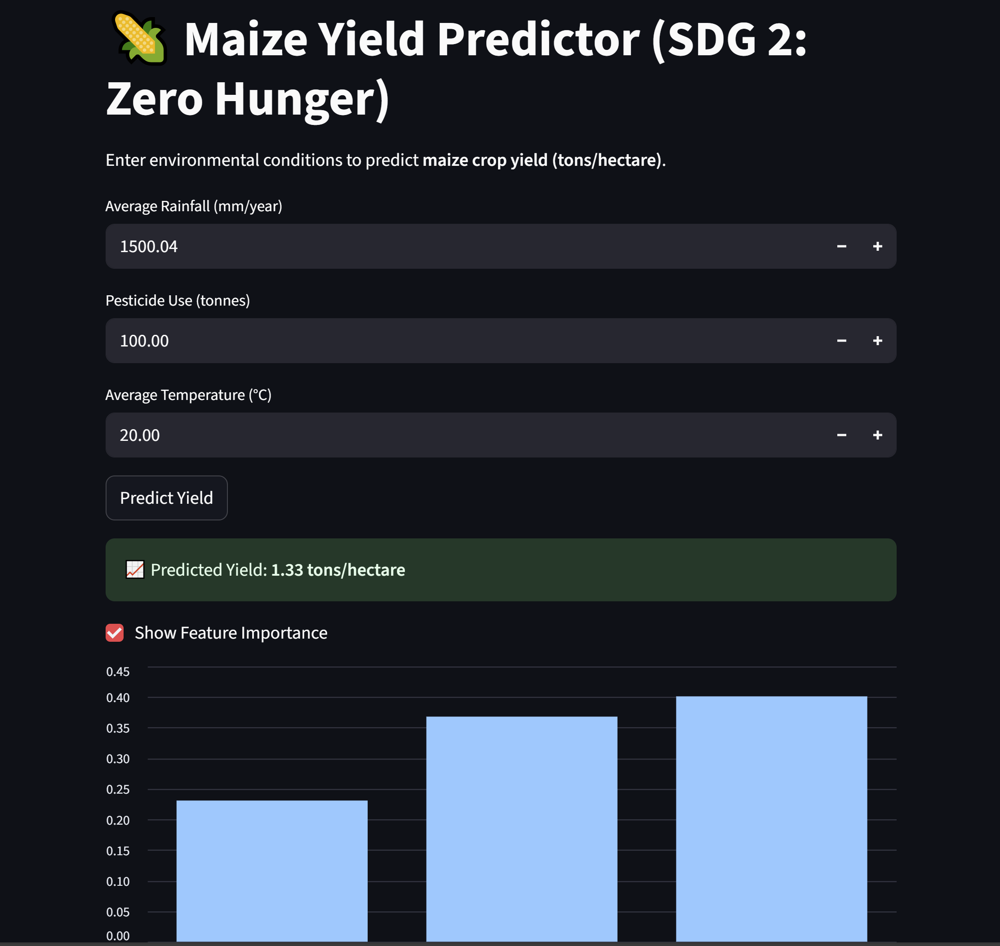

# 🌽 Maize Yield Prediction App – SDG 2: Zero Hunger

This project leverages machine learning to **predict maize crop yields** using environmental factors such as rainfall, pesticide usage, and temperature. It supports **United Nations Sustainable Development Goal 2 (Zero Hunger)** by providing actionable insights for farmers, researchers, and policy makers.

---

## 🚀 Project Overview

- **Problem Addressed**: Unpredictable maize yields due to climate and agricultural variability.
- **ML Technique**: Supervised Learning (Random Forest Regression)
- **Goal**: Predict maize yield (in tons/hectare) based on user-provided climate inputs.

---

## 📊 Model Features

- Average Rainfall (mm/year)
- Pesticide Use (tonnes)
- Average Temperature (°C)

---

## 🧠 How It Works

1. Loads and filters a global crop yield dataset for **maize only**.
2. Trains a **Random Forest Regressor** to predict crop yield (`hg/ha_yield`).
3. Converts predictions from **hectograms per hectare** to **tons per hectare**.
4. Offers an interactive **Streamlit web interface** for real-time predictions.

---

## 🖥️ Run the App Locally

### ✅ Prerequisites

- Python 3.8+
- Streamlit
- Pandas, NumPy, Scikit-learn

### 🔧 Installation

git clone https://github.com/mjt1/maize-yield-predictor.git
cd maize-yield-predictor
pip install -r requirements.txt
▶️ Start the App

streamlit run app.py
Then open your browser to http://localhost:8501.

🧾 Example Input
Rainfall: 1200 mm/year

Pesticide: 100 tonnes

Temperature: 25°C

Output: 📈 Predicted Yield: 1.71 tons/hectare

🧠 Ethical Considerations
📉 Bias Risk: Underrepresented regions may yield inaccurate predictions.

⚖️ Fairness: Use locally validated models to ensure equitable decision-making.

🌿 Sustainability: Supports proactive farming decisions and reduces food insecurity.

📂 File Structure
.
├── app.py               # Streamlit web app
├── yield_df.csv         # Crop yield dataset
├── requirements.txt     # Python dependencies
└── README.md            # This file

🌍 SDG Impact
This tool directly supports SDG 2: Zero Hunger by:

Providing data-driven yield forecasts

Helping optimize food production

Empowering rural farmers with simple, smart tools

📬 Contact
Made with ❤️ by Mercylyne Jepleting
LinkedIn | Mercylynetuwei@gmail.com

